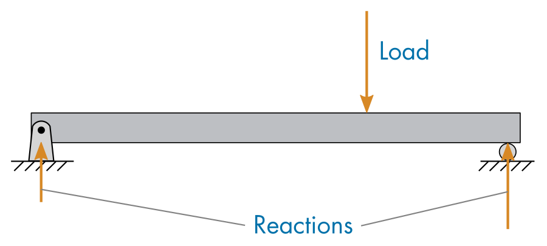

# Solid Mechanics: Beam Bending and Deflection

 **Add-Ons** > **Symbolic Math Toolbox and Deep Learning Toolbox**.

## **BeamBending.mlx**

| Image                                                        | **Key points**                                                                                                                                                                                      |
| :----------------------------------------------------------- | :-------------------------------------------------------------------------------------------------------------------------------------------------------------------------------------------------- |
|  |  • Solve for beam support reactions symbolically.  • Solve for the moment function of a loaded beam.  • Plot shear and moment diagrams.  • Compute the bending stress in a loaded beam. |

## **BeamDeflection.mlx**

| Image                                                        | **Key points**                                                                                                                                                                                                   |
| :----------------------------------------------------------- | :--------------------------------------------------------------------------------------------------------------------------------------------------------------------------------------------------------------- |
|  |  • Solve boundary value problems using symbolic math.  • Identify boundary conditions for different types of beam supports.  • Solve for deflections of loaded beams.  • Visualize beam deflections. |
